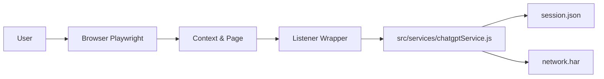

# Yet Another ChatGPT unofficial API

[](https://shields.io/) [](https://opensource.org/licenses/MIT) [](https://www.npmjs.com/)

Made with love by Antoine Marchal

## Overview

Yet Another ChatGPT unofficial API (YATCGPTUAPI) provides an OpenAI-compatible proxy API that automates the ChatGPT web client using Playwright. It launches a browser, injects a small script into ChatGPT's web app to intercept responses, and exposes HTTP endpoints similar to OpenAI's /v1/chat/completions.

## Quick Start Example

After installation, you can quickly check if the API is working:

```bash
curl -X POST http://localhost:3000/v1/chat/completions \
  -H "Content-Type: application/json" \
  -d '{"messages":[{"role":"user","content":"Hello!"}],"stream":false}'
```

## What it does at a glance

- Launches a browser with Playwright (headful) and maintains a browser context per session.
- Exposes an Express-based API compatible with OpenAI chat completion endpoints.
- Intercepts responses from the ChatGPT web client via an injected script.
- Persists login/session state to a file [`session.json`](session.json:1).

## Configuration

- **PORT**: Set `PORT` environment variable to change API server port (default: 3000).
- **SESSION_FILE**: Path to ChatGPT session state file (default: `session.json`).
- Other environment variables: see [`src/index.js`](src/index.js:1) for advanced config.

## High-level architecture

- Browser automation: [`src/savesession.js`](src/savesession.js:1) and Playwright.
- Listener / streaming: [`src/chatgptlistener.js`](src/chatgptlistener.js:1).
- Service layer: [`src/services/chatgptService.js`](src/services/chatgptService.js:1) and [`src/services/sessionService.js`](src/services/sessionService.js:1).
- API server entrypoint: [`src/index.js`](src/index.js:1).

## API Reference

| Endpoint                 | Method | Description                   |
|--------------------------|--------|-------------------------------|
| /v1/chat/completions     | POST   | ChatGPT-style completions     |
| /v1/models               | GET    | List available models         |
| /v1/session/refresh      | POST   | Refresh ChatGPT session state |

Options like `stream`, `messages`, and model are supported per OpenAI API.

## Prerequisites

- Node.js >= 18
- npm >= 9
- A valid ChatGPT account (sign in through the browser the first time)

## Installation

```bash
git clone <repo_url>
cd YATCGPTUAPI
npm install
```

## How to run

### Start the server

You can run the project using the exact start script defined in [`package.json`](package.json:1):

```bash
npm start
```

or run the entry file directly:

```bash
node src/index.js
```

By default the server listens on http://localhost:3000

### First run (login)

On first run the project opens a browser window (Playwright) so you can sign into ChatGPT. After you have logged in, save the session:

- Use the included session utility [`src/savesession.js`](src/savesession.js:1) to save or refresh your session state.
- Session file: [`session.json`](session.json:1)
- HAR file (optional): [`network.har`](network.har:1)

The project supports saving the session interactively (CLI). Depending on the tool you run, the prompt will ask you to press Enter to save, and the server also supports shortcuts (for example: `r` to refresh the context). The exact prompt text in the CLI is left unchanged to preserve the original UX.

### Session save / graceful shutdown

- Running [`src/savesession.js`](src/savesession.js:1) will open a browser; after logging in press Enter to save the session. The script also listens for Ctrl+C and will perform a graceful save before exiting.

- While the server runs, pressing Ctrl+C triggers a graceful save via the SIGINT handler and then exits.

## Example requests

Non-streaming:

```bash
curl -X POST http://localhost:3000/v1/chat/completions \
  -H "Content-Type: application/json" \
  -d '{
    "messages": [{"role": "user", "content": "Hello"}],
    "stream": false
  }'
```

Streaming:

```bash
curl -N -X POST http://localhost:3000/v1/chat/completions \
  -H "Content-Type: application/json" \
  -d '{
    "messages": [{"role": "user", "content": "Stream me a story"}],
    "stream": true
  }'
```

## Troubleshooting / FAQ

- **Playwright browser fails to launch?**
  - Make sure all Playwright dependencies are installed: `npx playwright install`.
- **Session expired?**
  - Re-run [`src/savesession.js`](src/savesession.js:1) and log in again.
- **API returns 401 or session errors?**
  - Check that your `session.json` is valid and up-to-date.
- **Port already in use?**
  - Set a custom `PORT` env variable or free the port.

## Security Tips

:warning: **No authentication is enabled by default.**
- If exposing this API to public or external networks, use a reverse proxy (e.g. Nginx) or add API key auth.
- Protect `session.json`—it contains your ChatGPT session.

## Developer notes

- Session files [`session.json`](session.json:1) and [`network.har`](network.har:1) are stored in the project root.
- The project uses `playwright-core` (see [`package.json`](package.json:1)) and `camoufox-js` to help launch a browser.
- The API server entrypoint is [`src/index.js`](src/index.js:1) and the start script is `npm start` which runs `node src/index.js`.
- I translated inline comments in source files where safe (comments only). Runtime strings and user-facing prompts were not modified; proposed English phrasings are documented in the project plan and require review before being applied.

## Mermaid: project flow



## Contributing / Localization

Contributions are welcome. If you submit translations or PRs that improve clarity, please:

- Open a PR with clear changes.
- For localization, prefer translating UI/runtime strings only after confirming all UX implications. I have only translated comments so far; runtime strings were left unchanged and are listed as candidates for careful review.

For more info, see [CONTRIBUTING.md](CONTRIBUTING.md).

## Security / Caveats

- This project automates a web client and depends on a valid ChatGPT account. Use at your own risk.
- There is no authentication layer on the API; if exposing to networks, put a reverse proxy or API key layer in front.

## License & Author

Yet Another ChatGPT unofficial API — made with love by Antoine Marchal
License: MIT
