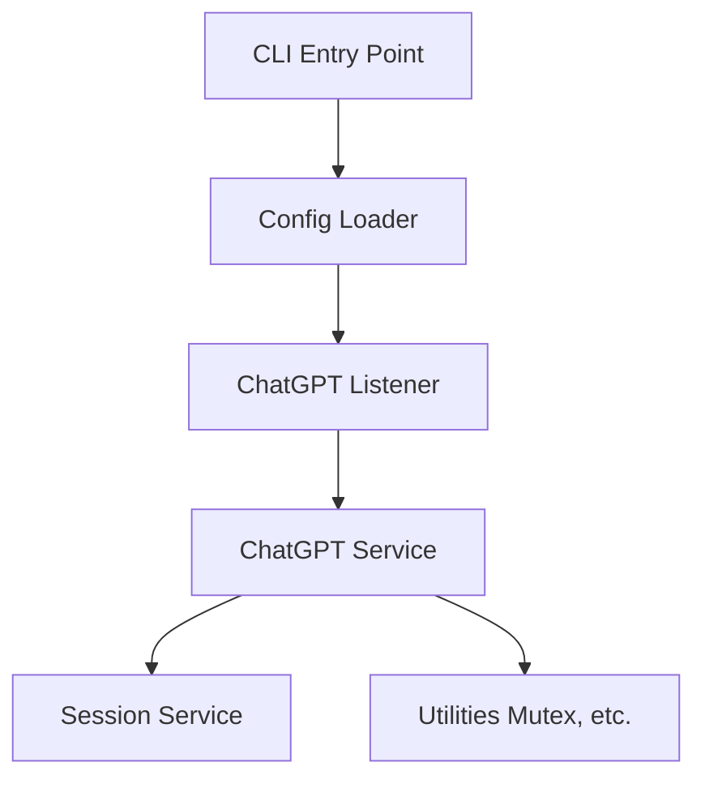
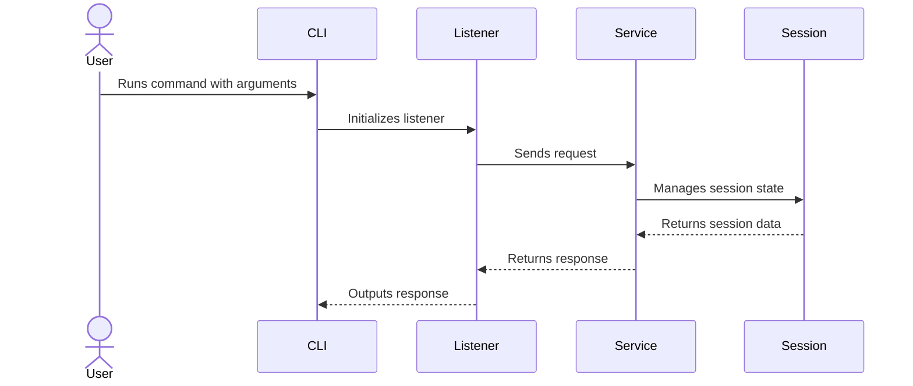

# YA-CGPT-UAPI


## Description
YA-CGPT-UAPI (Yet Another ChatGPT Unofficial API) is a Node.js-based middleware designed to provide a unified interface for interacting with ChatGPT models.
It standardizes communication, abstracts session handling, and offers a command-line interface (CLI) for quick integration and automation.
It runs on top of [Playwright](https://playwright.dev/) with the Camoufox browser, automating the ChatGPT web client to provide an **unofficial API**.
This makes it usable by AI agents such as **Kilo** **Crush** or **Shai**.

---

## Installation
```bash
git clone https://github.com/your-org/YA-CGPT-UAPI.git
cd YA-CGPTUAPI
npm install
```

---

## Build
```bash
npm run build
```

---

## Usage
You can run the project using Node.js:

```bash
node src/index.js --model gpt-5
```

---

## CLI Arguments

### CLI Options

| Flag            | Aliases        | Description                                   | Type    | Default         |
|-----------------|----------------|-----------------------------------------------|---------|-----------------|
| `--model <val>` | `--model=<val>`| Sets the model to use.                        | String  | `gpt-5-instant` |
| `--useprefix`   | None           | Enables use of prefix.                        | Boolean | `false`         |
| `--head`        | None           | Runs in non-headless mode (disables headless).| Boolean | `headless=true` (so `--head` sets it to `false`) |

---

## Architecture Overview



---

## Sequence Diagram



---

## Contributing
Contributions are welcome! Please fork the repository and submit pull requests.  
Be sure to follow the established coding style and include tests where applicable.

---

## License
This project is licensed under the MIT License.  
See the LICENSE file for details.

---

## Author
Developed with love by Antoine Marchal.
