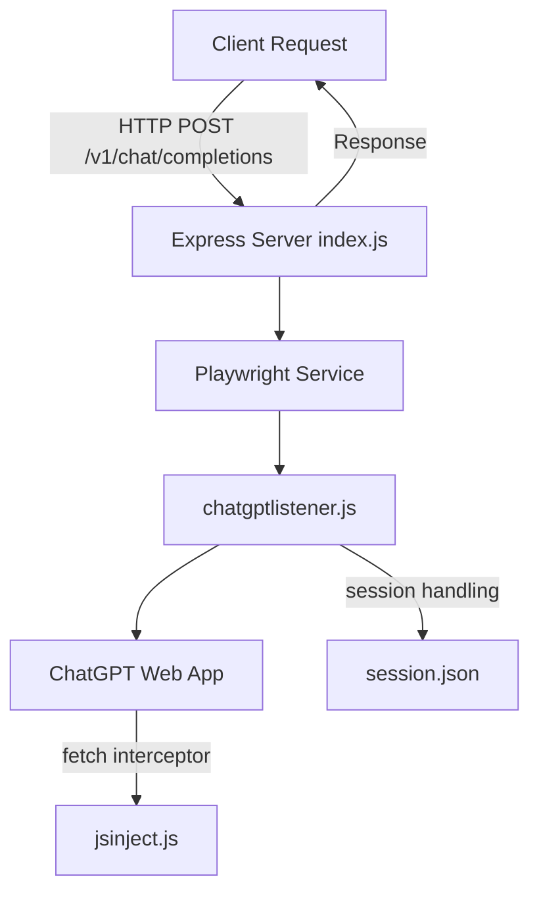

# YATCGPTUAPI

An **OpenAI-compatible proxy API** powered by Playwright that interacts with the ChatGPT web client.  
This project launches a browser, injects custom scripts, and exposes endpoints similar to OpenAI's API for chat completions.

---

## Features

- ✅ OpenAI-like `/v1/chat/completions` endpoint (streaming & non-streaming)
- ✅ Playwright automation of ChatGPT web UI
- ✅ Session persistence via `session.json`
- ✅ Request/response interception with `jsinject.js`
- ✅ Graceful shutdown & mutex handling for concurrency
- ✅ Save and reload ChatGPT sessions with `savesession.js`
- ✅ **Refresh context shortcut**: press `r` in the console to reset the browser context without restarting the server
- ✅ **Error handling**: prevents crashes on `413 Payload Too Large` or invalid requests
- ✅ **Build to `.exe`**: preconfigured `pkg` support to package into a standalone executable

---

## Prerequisites

- [Node.js](https://nodejs.org/) >= 18  
- [npm](https://www.npmjs.com/) >= 9  
- A valid [ChatGPT](https://chat.openai.com/) account  
- Chromium/Firefox installed (Playwright manages browsers, but `camoufox-js` is required)

---

## Installation

```bash
git clone <repo_url>
cd YATCGPTUAPI
npm install
```

---

## Usage

### 1. Start the API Server

```bash
node index.js
```

By default the server runs at:

```
http://localhost:3000
```

### 2. Test Chat Completions

```bash
curl -X POST http://localhost:3000/v1/chat/completions \
  -H "Content-Type: application/json" \
  -d '{
    "messages": [{"role": "user", "content": "Hello, who are you?"}],
    "stream": false
  }'
```

### 3. Streaming Example

```bash
curl -N -X POST http://localhost:3000/v1/chat/completions \
  -H "Content-Type: application/json" \
  -d '{
    "messages": [{"role": "user", "content": "Stream me a story"}],
    "stream": true
  }'
```

---

## Session Management

To persist your ChatGPT login session:

```bash
node savesession.js
```

- Press **Enter** to save and exit  
- Or press **Ctrl+C** for safe shutdown  

This creates/updates `session.json`.  

If `session.json` is missing or invalid, the API will not function.

---

## Development
### Refactored Folder Structure

```
src/
  services/
    chatgptService.js      # Manages Playwright browser & ChatGPT prompts
    sessionService.js      # Handles session save/load
  utils/
    mutex.js               # Simple mutex to serialize browser calls
chatgptlistener.js         # Browser automation & message streaming
savesession.js             # CLI tool to save/reuse ChatGPT sessions
jsinject.js                # Injected script to intercept ChatGPT responses
index.js                   # Express API server entrypoint
```

### Scripts

- [`index.js`](index.js) → Express API server (uses services for logic)
- [`src/services/chatgptService.js`](src/services/chatgptService.js) → ChatGPT Playwright wrapper
- [`src/services/sessionService.js`](src/services/sessionService.js) → Save/reuse ChatGPT sessions
- [`chatgptlistener.js`](chatgptlistener.js) → Browser automation & message streaming
- [`jsinject.js`](jsinject.js) → Injected script to intercept ChatGPT responses
- [`src/utils/mutex.js`](src/utils/mutex.js) → Mutex utility
- [`savesession.js`](savesession.js) → CLI session management tool

### Running in Development Mode

```bash
npm run dev
```

(Consider using [nodemon](https://www.npmjs.com/package/nodemon) for auto-reload.)

---

## System Architecture



---

## Known Limitations

- Requires a valid ChatGPT login session (`savesession.js`)  
- Depends on `playwright-core` and `camoufox-js`  
- Limited to one browser context at a time (mutex protected)  
- No authentication layer (consider reverse proxy + API keys)  

---

## Contributing

Pull requests are welcome! Please follow these steps:

1. Fork the repo & create your branch  
2. Run linting before submitting:  

```bash
npm run lint
```

3. Add/update tests where relevant  
4. Submit a PR 🎉  

---

## Roadmap

- [ ] Improve error handling & logging  
- [ ] Add test coverage (unit & integration)  
- [ ] CI/CD setup (GitHub Actions)  
- [ ] Multi-session browser contexts  
- [ ] Authentication middleware  

---

## License

MIT
## Building Windows Executable

This project uses **esbuild** + **pkg** to produce a distributable `.exe`.

### Steps
1. Install dependencies:
   ```sh
   npm install
   npm install --save-dev esbuild
   ```

2. Build bundled output:
   ```sh
   npm run build:bundle
   ```

   This creates `dist/bundle.js` (CommonJS bundle).

3. Package into executable:
   ```sh
   npm run build:exe
   ```

   This produces `dist/yatcgptuapi.exe`.

4. Run executable:
   ```sh
   ./dist/yatcgptuapi.exe
   ```

The bundling step ensures ESM syntax (`import`, `import.meta`, `await`) is transformed into a CommonJS-compatible format that `pkg` can compile without errors.