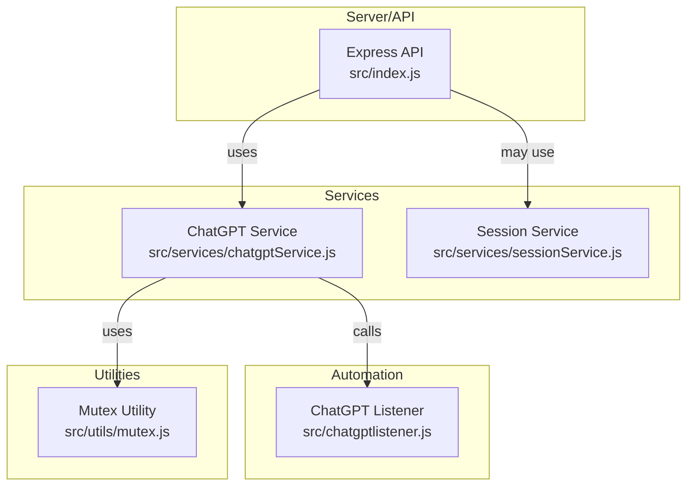

# Project Architecture Diagram

Below is a **high-level Mermaid.js diagram** representing the structure and main data flow for this app.

**Legend:**
- **A**: Main Express server (entry point, API routes, message handling)
- **B**: Service layer for ChatGPT operations (calls Playwright via D)
- **C**: Session management utilities
- **D**: Playwright browser automation for ChatGPT interactions
- **E**: Utility for concurrency/mutex logic

> This diagram shows how API calls received by the Express server flow through the ChatGPT service, which leverages browser automation, with utilities supporting concurrency and session state.
