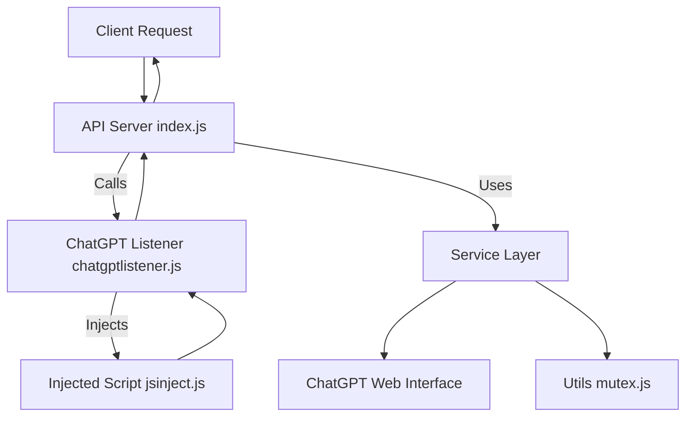
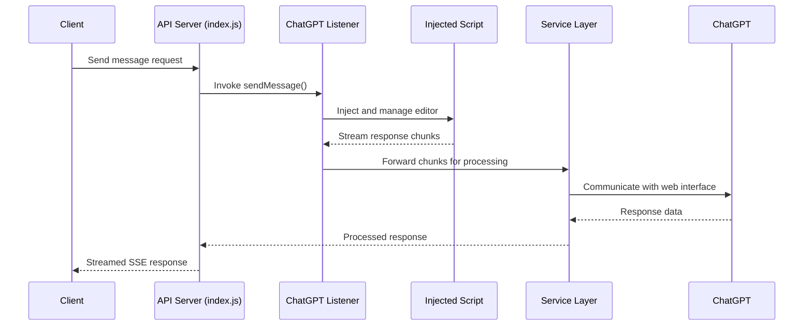

# Application Architecture

This document describes the architecture of the application, which integrates a Node.js server with automation scripts and service layers to interact with ChatGPT. It includes an overview, component relationships, and execution flow.

## Overview

The system is structured as follows:

- **API Server (`src/index.js`)**  
  Provides HTTP endpoints, handles CORS, manages Server-Sent Events (SSE), and coordinates request/response flow.

- **ChatGPT Listener (`src/chatgptlistener.js`)**  
  Uses Playwright automation to interact with ChatGPT's web interface. Provides functions to send messages, switch models, and process responses.

- **Injected Client Script (`src/jsinject.js`)**  
  Runs inside the browser context to intercept messages, manage state, and process response chunks from ChatGPT.

- **Services (`src/services/chatgptService.js`, `src/services/sessionService.js`)**  
  Encapsulate core business logic for handling sessions and message processing.

- **Utilities (`src/utils/mutex.js`)**  
  Provides concurrency primitives to ensure safe, sequential execution of tasks.

## Architecture Diagram

## Sequence Diagram

## README

This application is a Node.js-based integration with ChatGPT that automates browser interactions using Playwright and manages real-time response streaming through SSE. It is composed of a layered architecture with a clear separation between the server API, automation logic, injected browser scripts, service abstractions, and utility helpers.